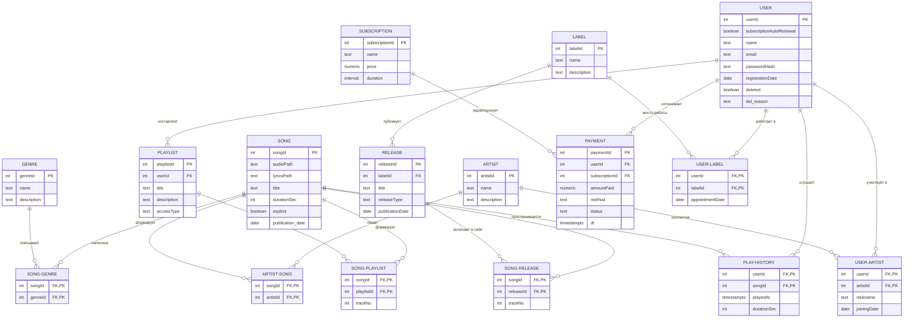

# Музыкальный стриминговый сервис

## ER-диаграмма

```mermaid
erDiagram
	SONG {
		int songId PK
		text audioPath
		text lyricsPath
		text title
		int durationSec
		boolean explicit
		date publication_date
	}

	GENRE {
		int genreId PK
		text name
		text description
	}

	ARTIST {
		int artistId PK
		text name
		text description
	}

	RELEASE {
		int releaseId PK
		int labelId FK
		text title
		text releaseType
		date publicationDate
	}

	PLAYLIST {
		int playlistId PK
		int userId FK
		text title
		text description
		text accessType
	}

	SONG-GENRE {
		int songId FK,PK
		int genreId FK,PK
	}

	ARTIST-SONG {
		int songId FK,PK
		int artistId FK,PK
	}

	SONG-RELEASE {
		int songId FK,PK
		int releaseId FK,PK
		int trackNo
	}

	SONG-PLAYLIST {
		int songId FK,PK
		int playlistId FK,PK
		int trackNo
	}

	LABEL {
		int labelId PK
		text name
		text description 
	}

	USER {
		int userId PK
		boolean subscriptionAutoRenewal
		text name
		text email
		text passwordHash
		date registrationDate
		boolean deleted
		text del_reason
	}

	SUBSCRIPTION {
		int subscriptionId PK
		text name
		numeric price
		interval duration
	}

	PAYMENT {
		int paymentId PK
		int userId FK
		int subscriptionId FK
		numeric amountPaid
		text method
		text status
		timestamptz dt
	}

	USER-LABEL {
		int userId FK,PK
		int labelId FK,PK
		date appointmentDate
	}

	USER-ARTIST {
		int userId FK,PK
		int artistId FK,PK
		text nickname
		date joiningDate
	}

	PLAY-HISTORY {
		int userId FK,PK
		int songId FK,PK
		timestamptz playedAt
		int durationSec
	}

	SONG ||--o{ SONG-GENRE : "формирует"
	GENRE ||--o{ SONG-GENRE : "описывает"

	ARTIST ||--o{ ARTIST-SONG : "пишет"
	SONG ||--o{ ARTIST-SONG : "написанa"

	SONG ||--o{ SONG-RELEASE : "формирует"
	RELEASE ||--o{ SONG-RELEASE : "включает в себя"

	SONG ||--o{ SONG-PLAYLIST : "формирует"
	PLAYLIST ||--o{ SONG-PLAYLIST : "содержит"

	LABEL ||--o{ RELEASE : "публикует"

	USER ||--o{ PLAYLIST : "составляет"

	USER ||--o{ PAYMENT : "оплачивает"

	SUBSCRIPTION ||--o{ PAYMENT : "характеризует"

	USER ||--o{ USER-LABEL : "работает в"
	LABEL ||--o{ USER-LABEL : "место работы"

	USER ||--o{ USER-ARTIST : "участвует в"
	ARTIST ||--o{ USER-ARTIST : "коллектив"

	USER ||--o{ PLAY-HISTORY : "слушает"
	SONG ||--o{ PLAY-HISTORY : "прослушивается"
```
